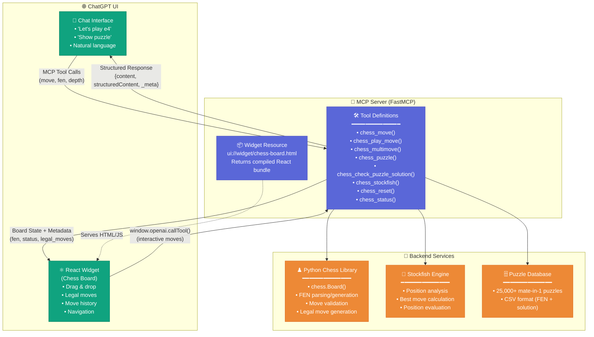

# ChatGPT MCP Chess App - Architecture & Code Guide

A complete guide to building a chat-native chess application inside ChatGPT using the Model Context Protocol (MCP) and custom React widgets.

---

## 🎯 Overview

This project demonstrates how to build a fully interactive, chat-native application that:
- Lives entirely inside ChatGPT's interface
- Uses MCP to expose backend functionality as callable tools
- Renders a custom React widget for visual interaction
- Maintains stateless architecture using FEN notation
- Integrates with Stockfish engine for AI opponent gameplay

---

## 🏗️ Architecture Diagram



**Key Data Flows:**

1. **Chat → MCP**: User types moves in natural language → ChatGPT calls MCP tools with parameters
2. **Widget → MCP**: User drags pieces → Widget validates locally → Calls MCP tool via `window.openai.callTool()`
3. **MCP → Backend**: Tools invoke chess library, Stockfish, or puzzle database
4. **MCP → UI**: Returns structured response with FEN string, game state, and metadata
5. **MCP → Widget**: Serves compiled React bundle as widget resource

---

## 🔑 Key Architectural Decisions

### 1. **Stateless Design**
Instead of maintaining server-side game sessions, we use **FEN strings** (Forsyth–Edwards Notation) to represent the complete board state. ChatGPT passes the FEN between tool calls, making the server completely stateless.

**Why this matters:**
- No session management complexity
- No server-side storage needed
- Naturally fits ChatGPT's conversation model
- Easy to replay or analyze any position

### 2. **Bidirectional Communication**
Users can interact in two ways:
- **Natural language in chat**: "e4", "knight to f3", "castle kingside"
- **Visual UI**: Drag and drop pieces, click moves

Both methods call the same MCP tools, keeping logic centralized.

### 3. **Widget-First UI**
The React widget isn't just a passive display—it's an active participant:
- Validates moves locally before calling tools
- Shows legal moves visually
- Provides move history navigation
- Syncs state with ChatGPT using OpenAI SDK hooks

---

## 📁 Code Structure & Key Files

### **Backend (MCP Server)**

```
server/
├── main.py                 # 🎯 MAIN MCP SERVER
│   ├── FastMCP initialization
│   ├── 8 tool definitions (@mcp.tool decorators)
│   ├── Widget resource registration
│   └── Stateless HTTP app setup
│
├── server.py               # Alternative server implementation
├── oauth_*.py              # OAuth 2.1 implementation files
└── data/
    └── mate-in-one.csv     # 25,000+ chess puzzles
```

### **Frontend (React Widget)**

```
src/
├── chess-board/
│   └── index.tsx           # 🎯 MAIN CHESS WIDGET
│       ├── ChessBoardWidget component
│       ├── useOpenAiGlobal() - theme, display mode
│       ├── useToolOutput() - receive tool results
│       ├── useWidgetState() - persist widget state
│       └── window.openai.callTool() - call back to MCP
│
├── types.ts                # TypeScript interfaces
├── use-openai-global.ts    # Hook for window.openai access
├── use-widget-props.ts     # Hook for tool output/metadata
└── use-widget-state.ts     # Hook for persistent state
```

### **Assets**

```
assets/
└── chess-board.html        # Compiled widget HTML (served by MCP)
```

---

## 🛠️ Core Implementation Patterns

### **Pattern 1: MCP Tool Definition**

Every tool follows this structure:

```python
@mcp.tool(
    name="chess_move",
    title="Make a chess move",
    description="Make a move on the chess board using algebraic notation",
    annotations={
        "readOnlyHint": False,
        "openai/outputTemplate": "ui://widget/chess-board.html",
        "openai/toolInvocation/invoking": "Making move...",
        "openai/toolInvocation/invoked": "Move played"
    }
)
def chess_move(move: str, fen: str = None) -> dict:
    # 1. Parse input (FEN string for current position)
    current_game = chess.Board(fen) if fen else chess.Board()
    
    # 2. Execute game logic
    chess_move_obj = current_game.parse_san(move)
    current_game.push(chess_move_obj)
    
    # 3. Return structured response
    return {
        "content": [{"type": "text", "text": f"Move played: {move}"}],
        "structuredContent": {
            "fen": current_game.fen(),
            "move": move,
            "status": get_game_status(current_game),
            "turn": "white" if current_game.turn == chess.WHITE else "black"
        },
        "_meta": {
            "full_state": {...},
            "legal_moves": [...]
        }
    }
```

**📍 See:** `server/main.py` lines 168-258 for `chess_move` implementation

---

### **Pattern 2: Widget State Synchronization**

The widget uses OpenAI SDK hooks to stay in sync with ChatGPT:

```typescript
// Receive tool output from MCP server
const toolOutput = useToolOutput<ChessToolOutput>();
const toolResponseMetadata = useToolResponseMetadata<ChessMetadata>();

// Persist widget-specific state (survives conversation context)
const [widgetState, setWidgetState] = useWidgetState<ChessWidgetState>({
    lastPosition: "start",
    currentMoveIndex: null,
});

// Update board when tool returns new position
useEffect(() => {
    if (toolOutput?.fen) {
        setPosition(toolOutput.fen);
        chess.load(toolOutput.fen);
        setWidgetState(prev => ({ 
            ...prev, 
            lastPosition: toolOutput.fen 
        }));
    }
}, [toolOutput]);
```

**📍 See:** `src/chess-board/index.tsx` lines 19-192

---

### **Pattern 3: Bidirectional Tool Calling**

Widget can call back to MCP tools for interactive moves:

```typescript
const onPieceDrop = (sourceSquare: string, targetSquare: string) => {
    // 1. Validate move locally (instant feedback)
    const move = chess.move({ from: sourceSquare, to: targetSquare });
    if (!move) return false;
    
    // 2. Undo local move (server is source of truth)
    chess.undo();
    
    // 3. Call MCP tool with current FEN
    window.openai?.callTool("chess_play_move", { 
        move: move.san,
        fen: currentFen,
        move_history: JSON.stringify(moveHistory)
    });
    
    return true;
};
```

**📍 See:** `src/chess-board/index.tsx` lines 208-247

---

### **Pattern 4: Stockfish Integration**

Playing against the engine with automatic responses:

```python
@mcp.tool(name="chess_play_move")
def chess_play_move(move: str, fen: str = None, depth: int = 10):
    # 1. Apply user's move
    current_game = chess.Board(fen or "start")
    user_move = current_game.parse_san(move)
    current_game.push(user_move)
    
    # 2. Get Stockfish response
    engine = stockfish.Stockfish()
    engine.set_fen_position(current_game.fen())
    stockfish_move_uci = engine.get_best_move()
    
    # 3. Apply Stockfish move
    stockfish_move_obj = chess.Move.from_uci(stockfish_move_uci)
    stockfish_move_san = current_game.san(stockfish_move_obj)
    current_game.push(stockfish_move_obj)
    
    # 4. Return both moves + evaluation
    return {
        "content": [{
            "type": "text", 
            "text": f"You played {move}. Stockfish responded with {stockfish_move_san}."
        }],
        "structuredContent": {
            "user_move": move,
            "stockfish_move": stockfish_move_san,
            "fen": current_game.fen(),
            "evaluation": eval_text
        }
    }
```

**📍 See:** `server/main.py` lines 396-651 for full `chess_play_move` implementation

---

## 🎮 Tool Inventory

| Tool Name | Purpose | Key Parameters | Returns Widget |
|-----------|---------|----------------|----------------|
| `chess_move` | Make a single move | `move` (e.g., "e4"), `fen` | ✅ |
| `chess_play_move` | Play vs Stockfish | `move`, `fen`, `depth` | ✅ |
| `chess_multimove` | Execute multiple moves at once | `moves` (e.g., "e4 c5 Nf3") | ✅ |
| `chess_puzzle` | Load mate-in-1 puzzle | `puzzle_id` (optional) | ✅ |
| `chess_check_puzzle_solution` | Validate puzzle answer | `move`, `puzzle_id`, `fen` | ✅ |
| `chess_stockfish` | Get engine analysis | `depth`, `fen` | ❌ |
| `chess_reset` | Start new game | None | ✅ |
| `chess_status` | Get current game info | `fen` | ❌ |

**📍 See:** `server/main.py` lines 1043-1299 for complete tool registrations

---

## 🔌 Integration Points

### **1. Tool Output → Widget**

When a tool executes, it returns:
- `content`: Plain text for ChatGPT to display
- `structuredContent`: Parsed data for the widget
- `_meta`: Additional metadata (move history, legal moves, etc.)

The widget receives this via `useToolOutput()` and updates accordingly.

**📍 See:** `src/chess-board/index.tsx` lines 169-192

---

### **2. Widget → Tool Call**

Widget buttons and interactions call tools:

```typescript
// New game button
const handleNewGame = () => {
    window.openai?.callTool("chess_reset", {});
};

// Puzzle button
const handleMateInOne = () => {
    window.openai?.callTool("chess_puzzle", {});
};
```

**📍 See:** `src/chess-board/index.tsx` lines 318-328

---

### **3. Widget Resource Serving**

MCP server serves the compiled widget as a resource:

```python
@mcp.resource(
    uri="ui://widget/chess-board.html",
    name="Chess Board Widget",
    description="Interactive chess board",
    mime_type="text/html+skybridge"
)
def get_chess_widget():
    # Load compiled React bundle
    js_path = Path(__file__).parent.parent / "web" / "dist" / "chess.js"
    js_content = js_path.read_text()
    
    return f"""
    <!DOCTYPE html>
    <html>
    <body>
        <div id="chess-root"></div>
        <script type="module">{js_content}</script>
    </body>
    </html>
    """
```

**📍 See:** `server/server.py` lines 730-777 for widget resource handler

---

## 🧩 State Management Strategy

### **ChatGPT Conversation Context**
- Tracks FEN string across messages
- Remembers last position
- Maintains conversation history

### **Widget State (Persistent)**
```typescript
interface ChessWidgetState {
    lastPosition: string;           // Last FEN
    currentMoveIndex: number | null; // For move navigation
    analysisVisible: boolean;        // UI preferences
    lastDepth: number;              // Stockfish depth
}
```

### **Component State (Ephemeral)**
- Selected square
- Highlighted legal moves
- Temporary UI states

**📍 See:** `src/types.ts` lines 1-132 for complete type definitions

---

## 🚀 Getting Started

### **1. Install Dependencies**

```bash
# Backend
cd server
pip install -r requirements.txt
brew install stockfish  # macOS

# Frontend
cd ../web
npm install
npm run build  # Compiles React widget
```

### **2. Run MCP Server**

```bash
cd server
python main.py
# Server runs on http://localhost:8000
```

### **3. Connect to ChatGPT**

Add MCP server to ChatGPT settings:
- Server URL: `http://localhost:8000`
- Protocol: MCP over HTTP

### **4. Start Playing**

In ChatGPT:
- "Let's play chess"
- "I'll play e4"
- "Show me a puzzle"

**📍 See:** `docs/HOW-TO-TEST-WITH-CHATGPT.md` for detailed setup guide

---

## 📊 Key Metrics & Lessons

### **Performance**
- Tool response time: ~200ms (move validation)
- Stockfish response: ~500ms (depth 10)
- Widget render time: <100ms
- Total interaction latency: ~1 second

### **Lessons Learned**

1. **Stateless > Stateful**: FEN-based state eliminates 80% of complexity
2. **Local validation first**: Instant UI feedback, then server confirmation
3. **Structured responses**: ChatGPT needs clear `structuredContent` to parse game state
4. **Widget SDK hooks**: Critical for proper state synchronization
5. **Error handling**: Return user-friendly errors in `content` field

---

## 🎁 What's Included in This Repo

✅ Complete MCP server implementation (FastMCP)  
✅ React widget with drag-and-drop chess board  
✅ Stockfish engine integration  
✅ 25,000+ chess puzzles database  
✅ Move history & navigation  
✅ OpenAI Apps SDK integration  
✅ TypeScript type definitions  
✅ Comprehensive documentation  

---

## 📚 Further Reading

- **MCP Specification**: [Model Context Protocol Docs](https://modelcontextprotocol.io/)
- **OpenAI Apps SDK**: [OpenAI Apps Documentation](https://platform.openai.com/docs/apps)
- **FastMCP**: [FastMCP GitHub](https://github.com/jlowin/fastmcp)
- **React Chessboard**: [react-chessboard](https://github.com/Clariity/react-chessboard)
- **Chess.js**: [chess.js Library](https://github.com/jhlywa/chess.js)

---

## 🤝 Contributing & Questions

This architecture can be adapted for any chat-native application:
- Games (tic-tac-toe, sudoku, card games)
- Calculators with visual output
- Data visualization tools
- Interactive tutorials

**Key takeaway:** MCP tools + custom widgets = powerful chat-native apps.

---

## 📝 License

MIT License - Feel free to use this architecture for your own projects!

---

Built with ❤️ using Model Context Protocol, FastMCP, React, and Chess.js

