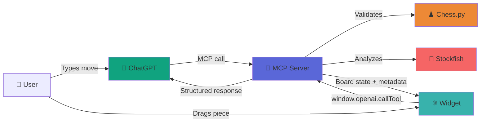

# Chess MCP - Product Overview

> **A fully interactive chess game that lives inside ChatGPT**

Built with Model Context Protocol (MCP) + React widgets, demonstrating the future of chat-native applications.

---

## 🎮 What It Looks Like

<div align="center">


*Live chess game integrated directly into ChatGPT's interface*

</div>

### Key UI Elements

1. **📱 Chat Interface** - Natural language commands ("e4", "Show me a puzzle")
2. **♟️ Interactive Chess Board** - Drag & drop pieces or click to move
3. **🕹️ Navigation Controls** - Step through move history (⏮ ◀ ▶ ⏭)
4. **🎯 Game Status** - Real-time updates ("White to move", "Check!", "Checkmate!")
5. **🎮 Action Buttons** - Start new games or load puzzles instantly
6. **🤖 AI Integration** - Stockfish responds automatically as Black

---

## ✨ What Makes This Special

### 🗣️ Conversational First

```
You: "Let's play chess. I'll open with e4"
→ Board appears, move is played
→ Stockfish responds with e5
→ ChatGPT: "Classic! The Open Game begins..."

You: "Show me a mate in 1 puzzle"
→ Puzzle loads on board
→ ChatGPT: "White to move and checkmate!"

You: "Qg7"
→ Move validates against puzzle solution
→ ChatGPT: "Brilliant! That's checkmate! 🎉"
```

### 🎯 Visual & Interactive

- **Drag and drop** pieces like a real chess app
- **Legal move highlights** when you click a piece
- **Move history navigation** - replay any position
- **Responsive design** - works on desktop and mobile
- **Theme-aware** - adapts to ChatGPT's light/dark mode

### 🧠 Smart Integration

- **Stateless architecture** - FEN strings track game state
- **Zero server sessions** - ChatGPT manages context
- **Instant validation** - Local move checking before server call
- **Rich metadata** - Game status, legal moves, evaluations

---

## 🎯 Use Cases

### 1. **Learning Chess**
- Play against Stockfish engine at any level
- Get real-time coaching from ChatGPT
- Practice with 25,000+ tactical puzzles
- Learn opening principles conversationally

### 2. **Game Analysis**
- Replay any position using move navigation
- Ask Stockfish for best moves
- Get positional explanations from ChatGPT
- Understand tactical patterns

### 3. **Casual Play**
- Quick games without leaving ChatGPT
- No accounts or logins required
- Save game state in conversation history
- Share positions via FEN strings

### 4. **Development Showcase**
- Demonstrates MCP + widget architecture
- Shows bidirectional chat-UI communication
- Example of stateless design patterns
- Reference for building chat-native apps

---

## 🏗️ Architecture Highlights



**Key Technical Wins:**

- ✅ **8 MCP Tools** exposed as natural language commands
- ✅ **Stateless** - No server-side sessions needed
- ✅ **Bidirectional** - Chat OR widget can trigger actions
- ✅ **Real-time** - Instant local validation + server confirmation
- ✅ **Persistent** - Widget state survives conversation context

---

## 🎨 User Experience Flow

### Starting a Game

**Option 1: Natural Language**
```
"Let's play chess"
"I'll play e4"
"Show me the starting position"
```

**Option 2: Widget Interaction**
- Click "New Game" button
- Board resets to starting position
- White's turn to move

### Making Moves

**Option 1: Type in Chat**
```
"e4"        → Pawn to e4
"Nf3"       → Knight to f3
"O-O"       → Castle kingside
"exd5"      → Pawn captures on d5
"e8=Q"      → Promote pawn to Queen
```

**Option 2: Drag & Drop**
- Click a piece to see legal moves (highlighted circles)
- Drag piece to destination square
- Widget validates → Calls MCP tool → Stockfish responds

### Navigation

**Keyboard Shortcuts:**
- `←` Previous move
- `→` Next move
- `Home` Go to start
- `End` Go to current position

**Visual Controls:**
- ⏮ Jump to start
- ◀ Previous move
- ▶ Next move
- ⏭ Current position

**Move History:**
- Click any move in history to jump to that position
- Current move highlighted in blue
- View-only mode when browsing history

### Puzzles

**Load a Puzzle:**
```
"Show me a puzzle"
"Give me a mate in 1"
"Load puzzle #42"
```

**Solve:**
```
"Qg7"       → Submit solution
```

**Feedback:**
- ✅ Correct: "🎉 Brilliant! That's checkmate!"
- ❌ Wrong: "💡 Not quite! Try again..."

---

## 📊 Technical Specs

### Performance
- **Tool response**: ~200ms (move validation)
- **Stockfish reply**: ~500ms (depth 10)
- **Widget render**: <100ms
- **Total interaction**: ~1 second end-to-end

### Capabilities
- ♟️ **Full chess rules** - Castling, en passant, promotion, 50-move rule
- 🎯 **25,000+ puzzles** - Mate-in-1 tactical positions
- 🤖 **Stockfish 16+** - World champion-level engine
- 📝 **Move history** - Unlimited undo/redo
- 🎨 **Theme support** - Light/dark mode
- 📱 **Responsive** - Desktop and mobile

### Data Format
- **Board state**: FEN strings (standard chess notation)
- **Move format**: Standard Algebraic Notation (SAN)
- **API protocol**: Model Context Protocol (MCP)
- **Widget format**: React 18 + TypeScript

---

## 🚀 For Developers

This project demonstrates how to build **chat-native applications** that feel like native apps while living entirely inside ChatGPT.

### What You Can Learn

1. **MCP Tool Design** - How to expose Python functions as callable tools
2. **Widget Architecture** - Building interactive React components for ChatGPT
3. **State Management** - Stateless design using FEN strings
4. **Bidirectional Communication** - Chat ↔ Widget ↔ MCP server
5. **OpenAI SDK Integration** - Hooks for theme, state, and tool calls

### Example Patterns

**Tool Definition:**
```python
@mcp.tool(
    name="chess_move",
    annotations={
        "openai/outputTemplate": "ui://widget/chess-board.html"
    }
)
def chess_move(move: str, fen: str = None):
    board = chess.Board(fen or "start")
    board.push_san(move)
    return {
        "structuredContent": {"fen": board.fen()},
        "_meta": {"legal_moves": [...]}
    }
```

**Widget Hook:**
```typescript
const toolOutput = useToolOutput<ChessToolOutput>();
const [widgetState, setWidgetState] = useWidgetState({
    lastPosition: "start"
});

useEffect(() => {
    if (toolOutput?.fen) {
        setPosition(toolOutput.fen);
    }
}, [toolOutput]);
```

**Tool Call from Widget:**
```typescript
window.openai?.callTool("chess_play_move", {
    move: "e4",
    fen: currentPosition
});
```

---

## 📚 Documentation

- **[Architecture Guide](./CHATGPT_MCP_ARCHITECTURE.md)** - Complete technical breakdown
- **[Setup Guide](../docs/SETUP_GUIDE.md)** - Installation and configuration
- **[Testing Guide](../docs/TESTING_GUIDE.md)** - How to test locally
- **[ChatGPT Integration](../docs/HOW-TO-TEST-WITH-CHATGPT.md)** - Connect to ChatGPT

---

## 🎯 Key Takeaways

### For Product Builders
- Chat-native apps feel **magical** when done right
- Users expect **both** conversational and visual interfaces
- State management is **simpler** with stateless design
- **Instant feedback** (local validation) is critical

### For Developers
- MCP makes backend tools **accessible** to LLMs
- React widgets provide **rich UI** in chat
- OpenAI SDK hooks enable **clean architecture**
- **Bidirectional** communication is key to great UX

### For Chess Players
- Playing chess in ChatGPT is **surprisingly natural**
- The **AI coach** commentary adds value
- **Puzzle practice** becomes conversational
- **No context switching** - everything in one place

---

## 🤝 Try It Yourself

This is a fully open-source project demonstrating the future of AI-native applications.

**Get Started:**
1. Clone the repo
2. Follow the [Setup Guide](../docs/SETUP_GUIDE.md)
3. Build your own chat-native app!

**Adapt for:**
- ✅ Other board games (Go, Checkers, Tic-Tac-Toe)
- ✅ Card games (Poker, Solitaire)
- ✅ Puzzles (Sudoku, Crosswords)
- ✅ Calculators with visualizations
- ✅ Data analysis dashboards
- ✅ Interactive tutorials

---

## 📝 License

MIT License - Build something amazing!

---

**Built with ❤️ using:**
- [Model Context Protocol](https://modelcontextprotocol.io/)
- [OpenAI Apps SDK](https://platform.openai.com/docs/apps)
- [FastMCP](https://github.com/jlowin/fastmcp)
- [React](https://react.dev/)
- [chess.js](https://github.com/jhlywa/chess.js)
- [Stockfish](https://stockfishchess.org/)

---

<div align="center">

**Questions? Want to build something similar?**

Check out the [Architecture Guide](./CHATGPT_MCP_ARCHITECTURE.md) for the complete technical breakdown.

</div>

